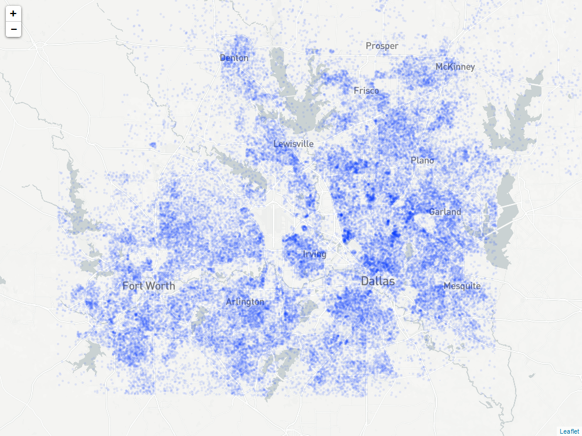

```{r, echo = FALSE, message = FALSE}


library(tidyverse)
library(tigris)
library(sf)
library(leaflet)
library(mapview)


options(tigris_class = "sf")
options(tigris_use_cache = TRUE)

```

We are interested in four main counties
* Dallas - which includes the City of Dallas
* Tarrant - which is how to Fort Worth
* Denton
* Collin

```{r, echo = FALSE, message = FALSE}

rm(list = ls())

url_base = "https://api.mapbox.com/styles/v1/steverd/cj79dgln2824t2spgb7cvhbwu/tiles/256/{z}/{x}/{y}?access_token=pk.eyJ1Ijoic3RldmVyZCIsImEiOiJ5T0hIMGU4In0.iRYeTkjtats3I4b2ZCBZVw"

# Shapefiles are also taken from NHGIS.org 
# Read shapefile and filter for: 
# Dallas (113), Tarrant (439), Denton (121) and Collin (085)
sf_blockgroup <- st_read("data/blockgroups/TX_blck_grp_2010.shp", 
                          stringsAsFactors = FALSE, quiet = TRUE) %>%
                  filter(COUNTYFP10 %in% c('113','439','121','085'))  %>%
                  st_transform(4326)


# Read in population data that was downloaded from NHGIS.org
# This estimates block group populations that are consistent with 2010 geographies

df_pop <- read_csv("data/population_by_bg.csv") %>% 
          select(GISJOIN = 'GIS Join Match Code',
                 pop00  = '2000: Persons: Total',
                 pop10  = '2010: Persons: Total')


# Merge the two data sets:
sf_data <- left_join(sf_blockgroup,df_pop)

# See this as a map:
#leaflet() %>% addTiles(url_base) %>%  addPolygons(data = sf_data, fillColor = 'transparent', weight = .75)
```


```{r, echo = FALSE, message = FALSE, warning = FALSE}

# GENERATE COORDINATES
# This can take a while...

# Data frame for population *level*. Each dot = 100 people           
num_dots_level <- as.data.frame(sf_data) %>%
                    select(pop10) %>%
                    mutate_all(funs(as.integer(round(. / 100))))

# Generate table of coordinates for population *growth*
sf_dots_level <-  map_df(names(num_dots_level), 
                      ~ st_sample(sf_data, size = num_dots_level[, .x], type = "random") %>%
                        st_cast("POINT") %>%
                        st_coordinates() %>%
                        as_tibble() %>% 
                        setNames(c("lon","lat")) %>%
                        mutate(year = .x)
                   )

```

```{r}

# PRODUCE A MAP
m <- leaflet() %>% addTiles(url_base) %>%  
              addCircles(data = sf_dots_level %>% filter(year == 'pop10'), 
                         radius = 250, 
                         weight = 0,fillOpacity = 0.1) %>% 
              setView(lng = -97, lat = 32.9, zoom = 10)

# Optional line for polygons:
#  addPolygons(data = dfw, weight = .5, fillColor = "transparent", color = "black")

mapshot(m, file = paste0(getwd(), "/map.png"),
        remove_controls = c("homeButton", "layersControl"))
```

```{r echo=FALSE, out.width='100%'}

```

```

